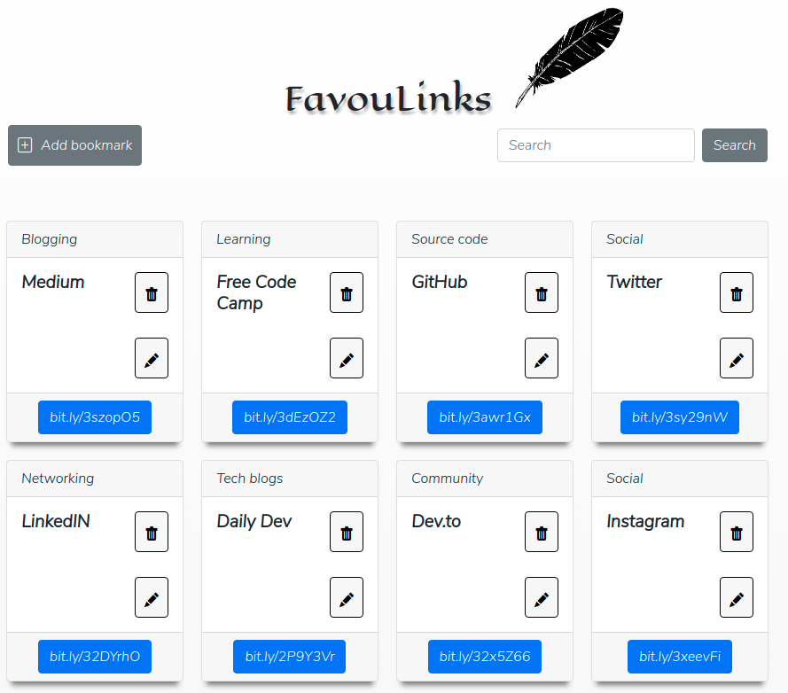

# Favoulinks
Favoulinks is an application where a user can store their favourites bookmarks for easy access in the future. Each bookmark should have a title, clickable URL and an optional category. Using Favoulinks users can create a new bookmark, read bookmarks created, update exists bookmarks and delete bookmarks stored.

# Technologies
This is the Favoulinks client-side repository. This front end was built in [React](https://reactjs.org/) using modern JS, [Boostrap](https://getbootstrap.com/) and [Styled Components](https://styled-components.com/).

# Installation
   * [Install NodeJS](https://nodejs.org/en/)
   * [Get NPM](https://www.npmjs.com/get-npm)
   * [To understand how the server-side works check the API repository](https://github.com/andressasantosaraujo/favoulinks-api)

# Usage
1. Download all the packages and dependencies of this project :
```bash
    npm i
```
2. Then, run the node script instruction to start the application:
```bash 
    npm start
```
3. Finally, you can view Favoulinks APP in the browser on `http://localhost:3000`.

    
